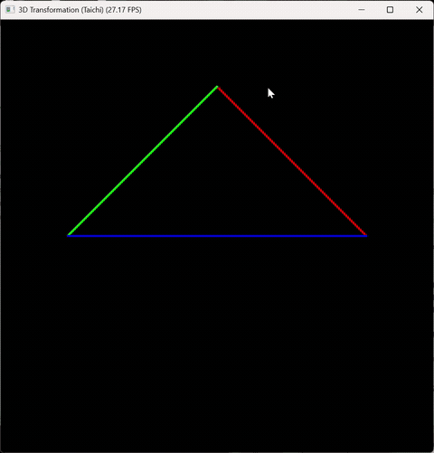

这是一个基于 Taichi 编程语言实现的 3D 三角形旋转变换可视化程序，通过 MVP（Model-View-Projection）矩阵变换链，将 3D 空间中的三角形投影到 2D 屏幕并实时渲染，支持通过键盘控制三角形的旋转角度。
功能说明
实现 3D 空间中三角形的模型矩阵（Model）旋转变换
构建视图矩阵（View）模拟相机视角（相机固定在 (0, 0, 5) 位置）
构建透视投影矩阵（Projection）将 3D 坐标投影到 2D 屏幕空间
通过键盘 A/D 键控制三角形绕 Z 轴旋转，ESC 键退出程序
实时渲染三角形的三条边（分别为红、绿、蓝三色）
核心原理
程序通过 MVP 矩阵变换完成 3D 到 2D 的投影：
Model 矩阵：对三角形进行旋转变换，绕 Z 轴旋转指定角度
View 矩阵：将坐标系原点移动到相机位置，模拟相机视角
Projection 矩阵：将透视投影转换为正交投影，最终得到 NDC（归一化设备坐标）
最终将 NDC 转换为屏幕坐标并渲染
环境依赖
Python 3.x
Taichi 库（推荐最新稳定版）
安装依赖：
bash
运行
pip install taichi
运行方式
将代码保存为 triangle.py
执行以下命令运行程序：
bash
运行
python triangle.py
操作指南
表格
按键	功能
A	三角形顺时针旋转（绕 Z 轴）
D	三角形逆时针旋转（绕 Z 轴）
ESC	退出程序
代码结构说明
表格
函数 / 变量	功能
get_model_matrix(angle)	生成绕 Z 轴旋转的模型矩阵
get_view_matrix(eye_pos)	生成视图矩阵（相机位置变换）
get_projection_matrix()	生成透视投影矩阵（包含正交投影转换）
compute_transform(angle)	核心计算内核：计算 MVP 矩阵并完成 3D 到 2D 坐标转换
main()	主函数：初始化顶点、创建 GUI、处理交互事件、渲染画面
vertices	存储三角形的 3D 顶点坐标
screen_coords	存储转换后的 2D 屏幕坐标
效果展示
运行程序后会弹出一个 700x700 的窗口，窗口中显示一个由红、绿、蓝三条边组成的三角形，按下 A/D 键可观察三角形的旋转变换效果，直观展示 3D 坐标到 2D 屏幕的投影过程。